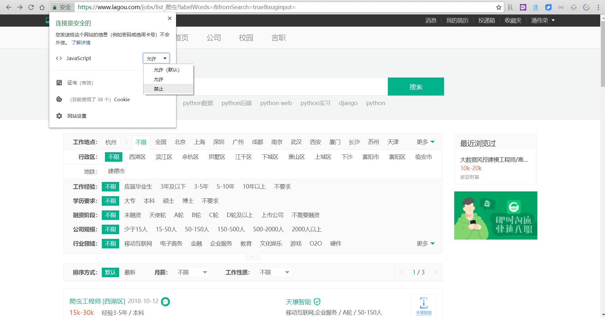
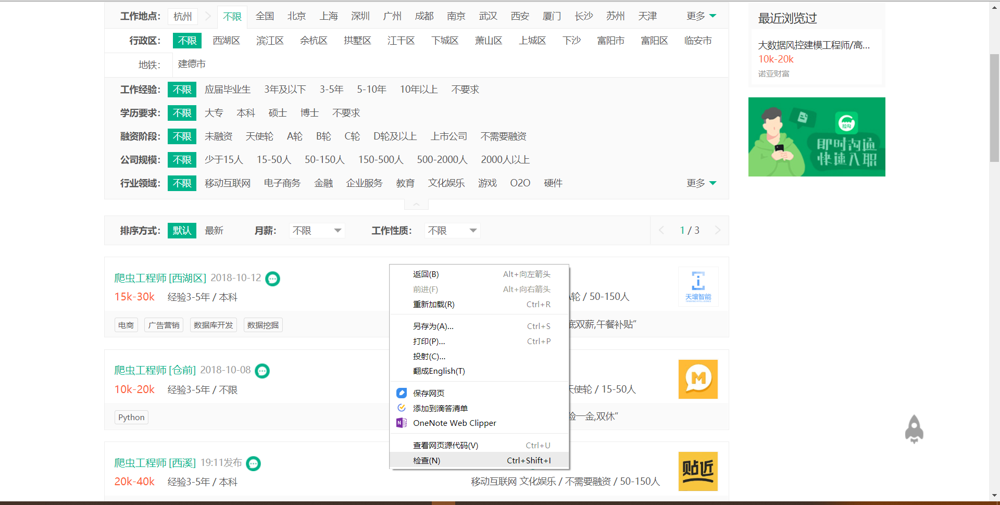
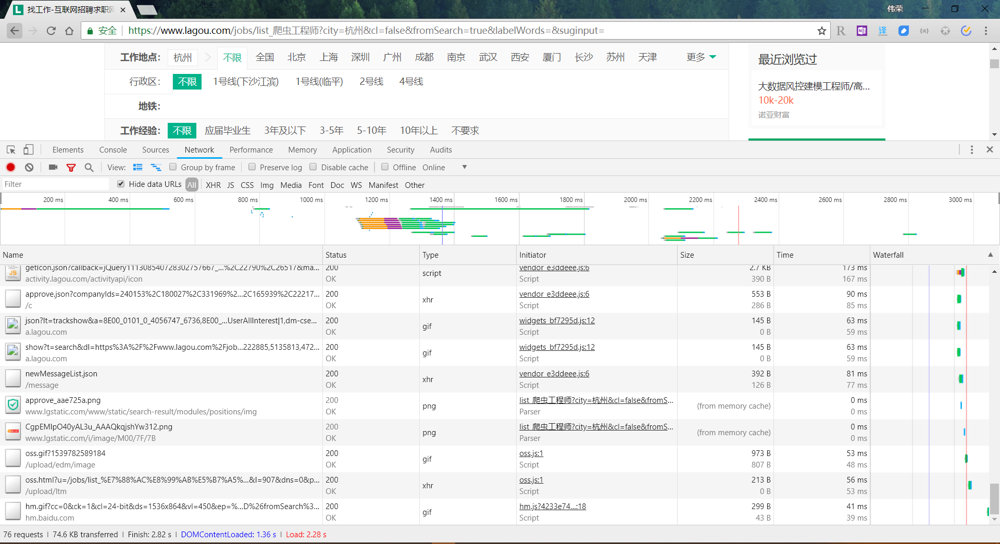
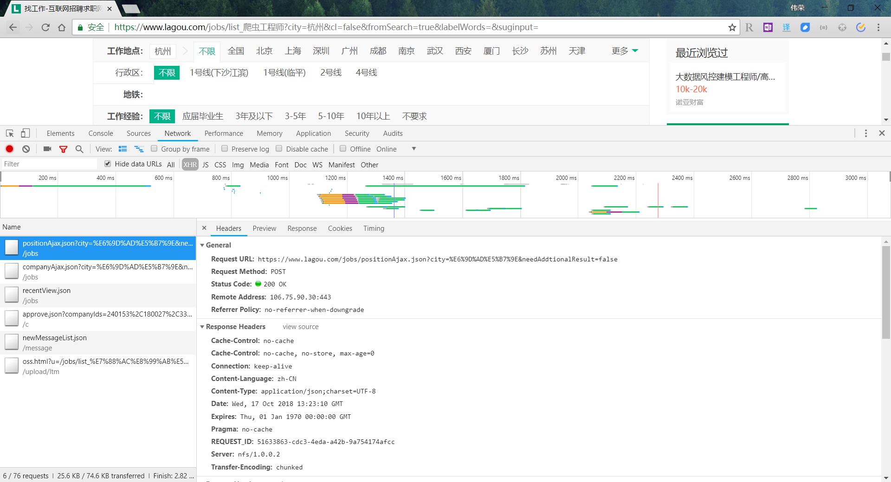
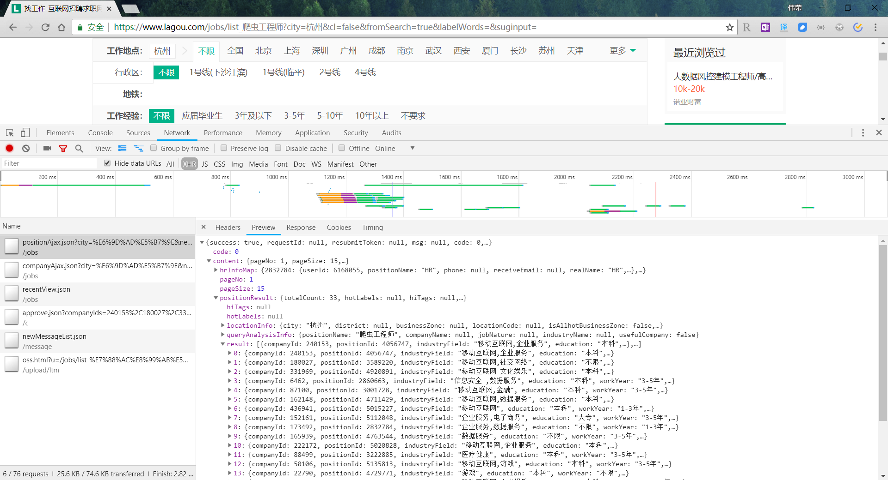
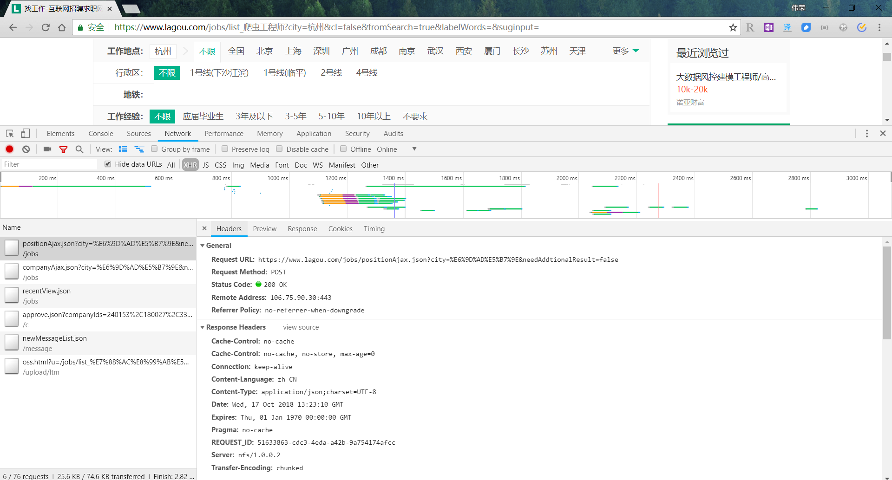
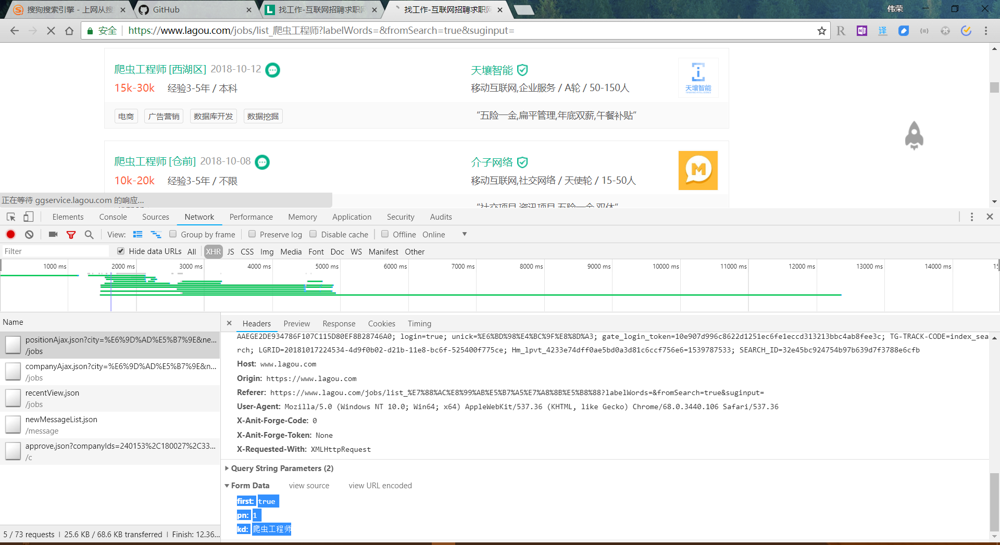

### 1. 动态加载的实例 

我们在分析要爬取的网页时，先确定目标内容的加载方式。如下图所示，在拉勾网搜索爬虫工程师职位，点击下一页，你会发现网址栏的 url 不会变化。

在 Chrome 浏览器左上角点击**安全**，再点击**禁止** JavaScript，**刷新**网页后发现职位信息全部被隐藏了，由此可见，职位信息是通过 异步 JavaScript 加载的。

大多数网页在浏览器中展示的内容都在HTML源代码中。但是，由于主流网站都使用 JavaScript 展现网页内容，和静态网页不同的是，在使用JavaScript时，很多内容并不会出现在HTML源代码中，所以爬取静态网页的技术可能无法正常使用。因此，我们需要用到动态网页抓取的两种技术：**浏览器抓包分析真实网页地址**和使用 **selenium** 模拟浏览器的方法。

**异步更新**：

AJAX（Asynchronous Javascript And XML，异步JavaScript和XML）。它的价值在于通过在后台与服务器进行少量数据交换就可以使网页实现异步更新。这意味着可以在不重新加载整个网页的情况下对网页的某部分进行更新。一方面减少了网页重复内容的下载，另一方面节省了流量，因此AJAX得到了广泛使用。

### 2. 通过浏览器工具抓包分析真实网页地址

第一步： 鼠标右键点击“检查”：

第二步： 点击 ‘Network’,然后刷新网页

第三步： 点击“XHR”，再点击第一条内容

第四步： 点击 Preview → content →positionResult → result

通过抓包分析，我们终于找到了要爬取的真实信息！

真实网络地址为：Request URL: 

https://www.lagou.com/jobs/positionAjax.json?city=%E6%9D%AD%E5%B7%9E&needAddtionalResult=false

第五步： 点击Headers 查看 request 加载方式

我们可以看到 requests 请求方式为 post  ,request请求需要设置 data：

